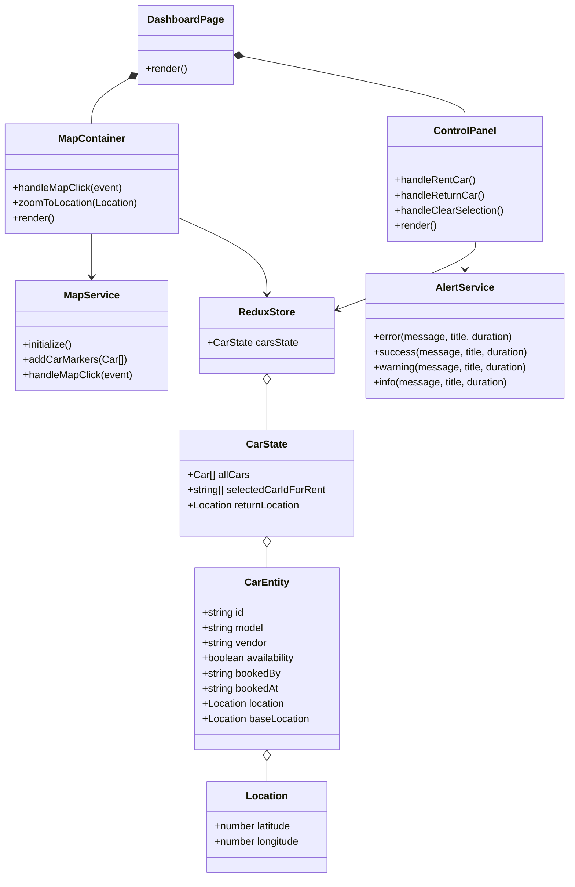

# Rent Ride - Car Rental Management System

A modern car rental management application built with React, TypeScript, and ArcGIS Maps. This application allows users to manage car rentals with an interactive map interface for location tracking.


## Table of Contents

- [Overview](#overview)
- [Architecture](#architecture)
- [Features](#features)
- [Setup Instructions](#setup-instructions)
  - [Prerequisites](#prerequisites)
  - [Environment Variables](#environment-variables)
  - [Installation](#installation)
- [Running the Application](#running-the-application)
  - [Standard Setup](#standard-setup)
  - [Docker Setup](#docker-setup)
- [Testing](#testing)
- [Deployment](#deployment)
  - [Standard Deployment](#standard-deployment)
  - [Docker Deployment](#docker-deployment)
- [UML Diagram](#uml-diagram)
- [License](#license)

## Overview

Rent Ride is a car rental management system that provides an intuitive interface for managing a fleet of rental cars. The application integrates with ArcGIS Maps to provide location-based functionalities like tracking car locations and selecting return locations.

## Architecture

The application follows a feature-based architecture with the following structure:

```
rent-ride/
├── frontend/ - React application with TypeScript
│   ├── src/
│   │   ├── features/ - Feature modules (dashboard, auth, etc.)
│   │   ├── redux/ - State management with Redux Toolkit
│   │   ├── shared/ - Shared components, services, and utilities
│   │   └── types/ - TypeScript type definitions
```

## Features

- **Interactive Map Interface**: View and interact with cars on a map
- **Car Rental Management**: Rent and return cars with user information
- **Real-time Location Tracking**: Track car locations in real-time
- **Return Location Selection**: Select return locations for cars via map interaction
- **Responsive Design**: Works on desktop and mobile devices

## Setup Instructions

### Prerequisites

- Node.js (v16 or higher) and npm (v7 or higher) OR Docker
- An ArcGIS Developer account for the API key

### Environment Variables

1. Create an `.env` file in the root directory by copying the provided example:

```sh
cp .env.example .env
```

2. Update the `.env` file with your ArcGIS API key:

```
ARCGIS_API_KEY=your_arcgis_api_key
```

#### Obtaining an ArcGIS API Key

1. Sign up for an [ArcGIS Developer account](https://developers.arcgis.com/sign-up/)
2. Create a new API key from the dashboard
3. Copy the API key to your `.env` file

For detailed instructions, visit the [ArcGIS Developer Documentation](https://developers.arcgis.com/documentation/mapping-apis-and-services/security/api-keys/)

### Installation

#### Standard Installation

1. Clone the repository:

```sh
git clone https://github.com/yourusername/rent-ride.git
cd rent-ride
```

2. Install frontend dependencies:

```sh
cd frontend
npm install
```

#### Docker Installation

1. Clone the repository:

```sh
git clone https://github.com/yourusername/rent-ride.git
cd rent-ride
```

2. Create the `.env` file as described in the Environment Variables section.

## Running the Application

### Standard Setup

To start the development server:

```sh
cd frontend
npm run dev
```

The application will be available at http://localhost:5173

### Docker Setup

#### Development Mode

To run the application in development mode with hot-reloading:

```sh
docker-compose up frontend-dev
```

The application will be available at http://localhost:5173

#### Production Mode

To run the application in production mode:

```sh
docker-compose up frontend
```

The application will be available at http://localhost:80

## Testing

### Standard Testing

Run the tests with:

```sh
cd frontend
npm test
```

For a specific test suite:

```sh
npm test -- -t "Car Rental Workflow"
```

### Docker Testing

Run tests inside the Docker container:

```sh
docker-compose run --rm frontend-dev npm test
```

For a specific test suite:

```sh
docker-compose run --rm frontend-dev npm test -- -t "Car Rental Workflow"
```

## Deployment

### Standard Deployment

To build the application for production:

```sh
cd frontend
npm run build
```

The build artifacts will be stored in the `dist/` directory.

### Docker Deployment

Build and deploy the Docker image:

```sh
# Build the Docker image
docker-compose build frontend

# Run the Docker container
docker-compose up -d frontend
```

For cloud deployments, you can push the Docker image to a container registry:

```sh
# Tag the image
docker tag rent-ride-frontend:latest your-registry/rent-ride-frontend:latest

# Push the image
docker push your-registry/rent-ride-frontend:latest
```

## UML Diagram

Below is a UML diagram representing the high-level architecture of the Rent Ride application:



## License

This project is licensed under the MIT License - see the LICENSE file for details.
